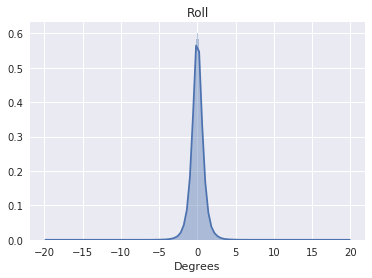
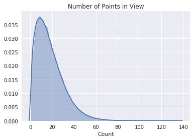

# TASK BANK: A Unified Bank of 25 Pretrained Vision Tasks

This repository provides a unified bank of pre-trained networks for **25 vision tasks spanning a wide range of 2D, 3D, and semantic problems**. We provide pretrained models, code for running the models on arbitrary images, as well as code for visualizing results similar to the ones shown below and [here](https://taskonomy.vision/tasks). The figure below shows the outputs for a query image (top left).

<div align="center">
  
</div>


### See sample results of the TASK BANK here: https://taskonomy.vision/#models
### Try the live demo here: https://taskonomy.vision/tasks
#### Reference Paper: "Taskonomy: Disentangling Task Transfer Learning", CVPR 2018.
Amir R. Zamir, Alexander Sax*, William B. Shen*, Leonidas Guibas, Jitendra Malik, Silvio Savarese. 

http://taskonomy.vision/ 


Table of contents
=================

   * [Introduction](#Introduction)
   * [Installation](#installation)
   * [Running Single Image Tasks](#running-single-image-tasks)
        * [Storing Representations](#storing-representations)
        * [Storing Predictions](#storing-predictions)
   * [Running Multi Image Tasks](#running-multi-image-tasks)
   * [Training Data Statistics](#training-data-statistics)
   * [Citing](#citing)


## Introduction


These models are based on specific networks of the [Taskonomy](http://taskonomy.vision/) project.
For more extensive discussions about Taskonomy and transfer learning, please see the [CVPR 2018 paper](http://taskonomy.vision/). This repository solely focuses on provding an easy to use unified bank for the pretrained vision tasks. 21 single image input tasks and 4 quadratic (2 input image) tasks are included. Single input tasks:


```
Autoencoder             Curvatures          Colorization             Denoising-Autoencoder 
Depth                   Edge-2D             Edge-3D                  Euclidean-Distance 
Inpainting              Jigsaw-Puzzle       Keypoint-2D              Keypoint-3D 
Object-Classification   Reshading           Room-Layout              Scene-Classification 
Segmentation-2D         Segmentation-3D     Segmentation-Semantic    Surface-Normal       
Vanishing-Point
```

The 4 quadratic tasks:

```
Pairwise-Nonfixated-Camera-Pose Pairwise-Fixated-Camera-Pose
Triplet-Fixated-Camera-Pose     Point-Matching
``` 
<div align="center">
  
</div>

### Network Architecture

As shown in the top figure, each task shares the same encoder architexture. The encoder maps the input image (256x256) into a representation of size 2048 (16x16x8). Hence the encoder architecture and representation size of all tasks are identical. The encoder is modified based on [ResNet-50](https://arxiv.org/pdf/1512.03385.pdf) by: 1. replacing `conv5_1`'s stride 2 convolution with stride 1 convolution. 2. No global average pooling. 

Also, we trained all of the networks on **the same exact set of input images**, i.e. the pixels seen in the input by all networks are identical and the only difference is in the output space. 

Since the tasks in our dictionary can have different dimensionalities in their output, we have a varying decoder architecture accordingly. We tried to keep the decoder structure compact and varying as little as possible. Also, slighlty different kind of loss could be employed for different tasks accordingly. See below table for the complete information.

<div align="center">
  
</div>

### Evaluation: How good are these networks?
For a complete discussion on the evaluation of the networks, please see the [paper](http://taskonomy.vision/). To give a quick overall idea, the table below shows the proportion (%) of a hold-out test set for which the networks in the task bank
were able to beat average estimator (`avg`), i.e. the best statistically informed guess, and a network trained on random nonlinear projections (Gaussian representation - `rand`). The numbers denote the good quality of the networks statistically. Qualititave results run frame-by-frame on a YouTube video can be examined [here](https://taskonomy.vision/#models).  

<div align="center">
  
</div>


## Installation

### Clone the Code from Github

```
git clone https://github.com/StanfordVL/taskonomy.git
cd taskonomy/taskbank
```


### Python

See [`requirement.txt`](https://github.com/StanfordVL/taskonomy/blob/master/taskbank/requirement.txt) for a list of used packages. 

We recommend doing a clean installment using virtualenv:
```bash
conda create -n testenv python=3.4
source activate testenv
pip install -r requirement.txt 
```

You can also install the requirements through:
```bash
pip install -r requirement.txt --no-index
```

### Tensorflow

You need [Tensorflow](https://www.tensorflow.org/install/). We use Version 1.2.1.


## Running Single Image Tasks

While in `taskonomy/taskbank` folder:

#### Step 1: Downloading Pretrained Model

```
sh tools/download_model.sh
```

#### Step 2: Run Demo Script

To run a pretrained model on a specific image, do:
```bash
python tools/run_img_task.py --task $TASK --img $PATH_TO_INPUT --store $WHERE_TO_STORE
```

For the `--task` flag, find the task name in [Task Name Dictionary](https://github.com/StanfordVL/taskonomy/blob/master/taskbank/tools/task_dict.txt), for example, according to the dictionary:
```
Surface-Normal : rgb2sfnorm
```

<div align="center">
  
  <p>Example Test Image</p>
</div>

Then, we can run the script on our [example image](https://github.com/StanfordVL/taskonomy/blob/master/taskbank/assets/test.png) as such:

```bash
python tools/run_img_task.py --task rgb2sfnorm --img assets/test.png --store assets/test_sf.png
```

Which will give us image [`test_sf.png`](https://github.com/StanfordVL/taskonomy/blob/master/taskbank/assets/test_sf.png):
<div align="center">
  
  <p>Test Image Surface Normal Estimation</p>
</div>

Similarly, low-dimensional task uses the same script. For example:
```
Scene-Classification : class_places
```
Again, we can run the script on our example image using:

```bash
python tools/run_img_task.py --task class_places --img assets/test.png --store assets/test_places.png
```

Which will give us image [`test_places.png`](https://github.com/StanfordVL/taskonomy/blob/master/taskbank/assets/test_places.png):
<div align="center">
  
  <p>Test Image Scene Classification</p>
</div>

### Storing Representations
Use the flag `--store-rep` to store the representation of the image prduced by task's encoder. Add `--store-rep` flag to the command and the representation will be stored at `${WHERE_TO_STORE}.npy`. For example, running:
```bash
python tools/run_img_task.py --task class_places --img assets/test.png --store assets/test_places.png --store-rep
```
will store the representation of the image's representation under Scene Classification encoder at `assets/test_places.npy`.

### Storing Predictions
To save the output of the numerical prediction of the network, e.g. the coordiantes of the predicted vanishing points, besides the visualization of it saved as `.png`, use the flag `--store-pred`. Add `--store-pred` flag to the command and the prediction will be stored at `${WHERE_TO_STORE}_pred.npy`. For example, running:
```bash
python tools/run_img_task.py --task class_places --img assets/test.png --store assets/test_places.png --store-pred
```
Will store the prediction of the image's Scene Classification result at `assets/test_places_pred.npy`.

## Running Multi Image Tasks

#### Step 1: Downloading Pretrained Model

```
sh tools/download_model_quadratic.sh
```

#### Step 2: Run Demo Script

To run a pretrained quadratic model on specific images (in case of Triplet-Fixated-Camera-Pose, `--img` should be `$IMG1,$IMG2,$IMG3`), do:
```bash
python tools/run_quad_img_task.py --task $TASK --img $IMG1,$IMG2 --store $WHERE_TO_STORE
```
Similarly for the `--task` flag, find the task name in [Task Name Dictionary](https://github.com/StanfordVL/taskonomy/blob/master/taskbank/tools/task_dict.txt), for example, according to the dictionary:
```
Pairwise-Nonfixated-Camera-Pose : non_fixated_pose
```
<div align="center">
  
  <p>Camera Pose Input (left: test_1.png, right:test.png)</p>
</div>

Then, we can run the script on our [example image 1](https://github.com/StanfordVL/taskonomy/blob/master/taskbank/assets/test.png) and [example image 2](https://github.com/StanfordVL/taskonomy/blob/master/taskbank/assets/test_1.png) as such:

```bash
python tools/run_quad_img_task.py --task non_fixated_pose --img assets/test_1.png,assets/test.png --store assets/test_pose.png
```
Note: camera pose is calculate with reference to the second image (here that is `test.png`).

The script will give us image [`assets/test_pose.png`](https://github.com/StanfordVL/taskonomy/blob/master/taskbank/assets/test_places.png):
<div align="center">
  
  <p>Camera Pose Estimation (green represents `test.png`'s camera. Red represents `test_1.png`'s.)</p>
</div>

The `--store-rep` and `--store-pred` flags work the same as in singe image task code `run_img_task.py` .


## Training Data Statistics

The dataset consists of **3.99 million images** from **2265 different buildings**. The images are **indoors** only. Below are some statistics about the images which comprise the training dataset. If your query images severly deviate from these statistics, the performance is expected to degrade. 

| Property | Mean | Distribution |
|----|---|----|
| **Camera Pitch** | -0.77° |  | 
| **Camera Roll** | 0.0° |   | 
| **Camera Field of view** | 75° | *Constant*  |
| **Distance**  (from camera to scene content)| 5.5m |   |
| **3D Obliqueness of Scene Content** (wrt camera)| 52.5° |   |
| **Points in view** (for point correspondences) | (median) 15 |   |


## Citing

If you find the code or the models useful, please cite this paper:
```
@inproceedings{zamir2018taskonomy,
  title={Taskonomy: Disentangling Task Transfer Learning},
  author={Zamir, Amir R and Sax, Alexander and and Shen, William B and Guibas, Leonidas and Malik, Jitendra and Savarese, Silvio},
  booktitle={2018 IEEE Conference on Computer Vision and Pattern Recognition (CVPR)},
  year={2018},
  organization={IEEE}
}
```

### License

The code and models are released under the MIT License (refer to the [LICENSE](https://github.com/StanfordVL/taskonomy/blob/master/LICENSE) file for details).
 

