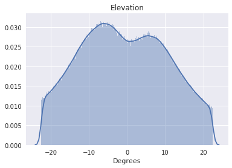
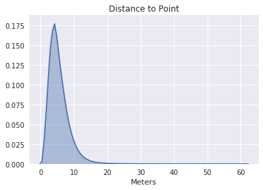
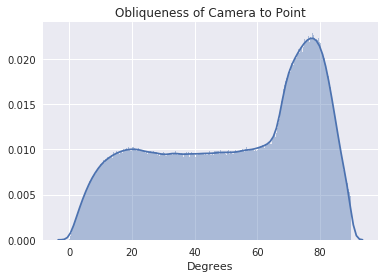

# TASK BANK: A Unified Bank of 25 Pretrained Vision Tasks

This repository provides a unified bank of pre-trained networks for **25 vision tasks spanning a wide range of 2D, 3D, and semantic problems**. We provide pretrained models, code for running the models on arbitrary images, as well as code for visualizing results similar to the ones shown below and [here](https://taskonomy.vision/tasks). The figure below shows the outputs for a query image (top left).

<div align="center">
  
</div>


### See sample results of the TASK BANK here: https://taskonomy.vision/#models
### Try the live demo here: https://taskonomy.vision/tasks
#### Reference Paper: "Taskonomy: Disentangling Task Transfer Learning", CVPR 2018.
Amir R. Zamir, Alexander Sax*, William B. Shen*, Leonidas Guibas, Jitendra Malik, Silvio Savarese. 

http://taskonomy.vision/ 


Table of contents
=================

   * [Introduction](#Introduction)
   * [Installation](#installation)
   * [Running Single-Image Tasks](#running-single-image-tasks)
        * [Storing Representations](#storing-representations)
        * [Storing Predictions](#storing-predictions)
   * [Running Multi-Image Tasks](#running-multi-image-tasks)
   * [Training Data Statistics](#training-data-statistics)
   * [Citing](#citing)


## Introduction


These models are based on task specific networks of the [Taskonomy](http://taskonomy.vision/) project.
For more extensive discussions about Taskonomy and transfer learning, please see the [CVPR 2018 paper](http://taskonomy.vision/). This repository focuses on provding an easy to use unified bank for the pretrained vision tasks. There are 21 tasks accepting one image as input (e.g. image to surface normals) and 4 tasks accepting multiple (e.g. relative camera pose estimation). Detailed definitions of each task is provided [here](https://github.com/StanfordVL/taskonomy/blob/master/taskbank/assets/web_assets/task_definitions.pdf).

The single-image tasks:


```
Autoencoder             Curvatures          Colorization             Denoising-Autoencoder 
Depth                   Edge-2D             Edge-3D                  Euclidean-Distance 
Inpainting              Jigsaw-Puzzle       Keypoint-2D              Keypoint-3D 
Object-Classification   Reshading           Room-Layout              Scene-Classification 
Segmentation-2D         Segmentation-3D     Segmentation-Semantic    Surface-Normal       
Vanishing-Point
```

The multi-image tasks:

```
Pairwise-Nonfixated-Camera-Pose Pairwise-Fixated-Camera-Pose
Triplet-Fixated-Camera-Pose     Point-Matching
``` 
<div align="center">
  
</div>

### Network Architecture

As shown in the top figure, each task shares the same encoder architexture. The encoder maps the input image (256x256) into a representation of size 2048 (16x16x8). Hence the encoder architecture and representation size of all tasks are identical. The encoder is modified based on [ResNet-50](https://arxiv.org/pdf/1512.03385.pdf) by: 1. replacing `conv5_1`'s stride 2 convolution with stride 1 convolution. 2. No global average pooling. 

Also, we trained all of the networks on **the same exact set of input images**, i.e. the pixels seen in the input by all networks are identical and the only difference is in the output space. 

Since the tasks in our dictionary can have different dimensionalities in their output, we have a varying decoder architecture accordingly. We tried to keep the decoder structure compact and varying as little as possible. Also, slighlty different kind of loss could be employed for different tasks accordingly. See below table for the complete information.

<div align="center">
  
</div>


## Installation

### Step 1: Clone the Code from Github

```
git clone https://github.com/StanfordVL/taskonomy.git
cd taskonomy/taskbank
```


### Python

See [`requirement.txt`](https://github.com/StanfordVL/taskonomy/blob/master/taskbank/requirement.txt) for a list of used packages. 

Step 2: We recommend doing a clean installation of requirements using virtualenv:
```bash
conda create -n testenv python=3.4
source activate testenv
pip install -r requirement.txt 
```

You could also directly install the requirements through the following if you dont want to do the above clean installation via virtualenv:
```bash
pip install -r requirement.txt --no-index
```

**Tensorflow**: Note that you need [Tensorflow](https://www.tensorflow.org/install/). We used Version 1.2.1.


## Running Single-Image Tasks

While in `taskonomy/taskbank` folder:

#### Step 1: Download Pretrained Models

```
sh tools/download_model.sh
```

#### Step 2: Run Demo Script

To run the pretrained model of a task on a specific image, do:
```bash
python tools/run_img_task.py --task $TASK --img $PATH_TO_INPUT --store $WHERE_TO_STORE
```

For the `--task` flag which specifies the task being run on the query image, find the task name in [Task Name Dictionary](https://github.com/StanfordVL/taskonomy/blob/master/taskbank/tools/task_dict.txt). For example, according to the dictionary:
```
Surface-Normal : rgb2sfnorm
```

Then, we can run the script on our [example image](https://github.com/StanfordVL/taskonomy/blob/master/taskbank/assets/test.png) as such:

```bash
python tools/run_img_task.py --task rgb2sfnorm --img assets/test.png --store assets/test_sf.png
```

<div align="center">
  
  <p>Example Test Image</p>
</div>

Which will give us image [`test_sf.png`](https://github.com/StanfordVL/taskonomy/blob/master/taskbank/assets/web_assets/test_sf.png):
<div align="center">
  
  <p>Surface Normal Estimation on the Test Image</p>
</div>

Similarly, non pixel-to-pixel tasks which produce lower dimensional (e.g. vanishing points) or classification (e.g. scene classification) outputs uses the same script. For example:
```
Scene-Classification : class_places
```
Again, we can run the script on our example image using:

```bash
python tools/run_img_task.py --task class_places --img assets/test.png --store assets/test_scene_class.png
```

Which will give us image [`test_scene_class.png`](https://github.com/StanfordVL/taskonomy/blob/master/taskbank/assets/test_places.png):
<div align="center">
  
  <p>Scene Classification on Test Image </p>
</div>

### Storing Representations
The flag `--store-rep` enables saving the representation of the image prduced by task's encoder. Add `--store-rep` to the command and the representation will be stored at `${WHERE_TO_STORE}.npy`. For example, running:
```bash
python tools/run_img_task.py --task class_places --img assets/test.png --store assets/test_scene_class.png --store-rep
```
will store the representation of `test.png` by the scene classification task encoder at `assets/test_scene_class.npy`.

### Storing Predictions
To save the numerical prediction of the network, e.g. coordiantes of the predicted vanishing points besides its png visualization, use the flag `--store-pred`. Add `--store-pred` to the command and the prediction will be stored at `${WHERE_TO_STORE}_pred.npy`. For example, running:
```bash
python tools/run_img_task.py --task class_places --img assets/test.png --store assets/test_scene_class.png --store-pred
```
will store predicted scene classes at `assets/test_scene_class.npy`.

## Running Multi-Image Tasks

Running tasks with multiple images in their input is pretty similar to the same process for single image tasks.

#### Step 1: Download Pretrained Models

```
sh tools/download_model_multi.sh
```

#### Step 2: Run Demo Script

To run a pretrained multi-image model on specific images (in case of Triplet-Fixated-Camera-Pose, `--img` should be `$IMG1,$IMG2,$IMG3` since the task requires 3 images in input. See [task definitions](https://github.com/StanfordVL/taskonomy/blob/master/taskbank/assets/web_assets/task_definitions.pdf)), do:
```bash
python tools/run_quad_img_task.py --task $TASK --img $IMG1,$IMG2 --store $WHERE_TO_STORE
```
Similarly for the `--task` flag, find the task name in [Task Name Dictionary](https://github.com/StanfordVL/taskonomy/blob/master/taskbank/tools/task_dict.txt). For example, according to the dictionary:
```
Pairwise-Nonfixated-Camera-Pose : non_fixated_pose
```
<div align="center">
  
  <p>Camera Pose Estimation - Input Images (left: test_1.png, right:test.png)</p>
</div>

Then, we can run the script on our [example image 1](https://github.com/StanfordVL/taskonomy/blob/master/taskbank/assets/test.png) and [example image 2](https://github.com/StanfordVL/taskonomy/blob/master/taskbank/assets/test_1.png) as such:

```bash
python tools/run_quad_img_task.py --task non_fixated_pose --img assets/test_1.png,assets/test.png --store assets/test_pose.png
```
Note: camera pose is calculate with reference to the second image (here that is `test.png`).

The script will give us [`assets/web_assets/test_pose.png`](https://github.com/StanfordVL/taskonomy/blob/master/taskbank/assets/web_assets/test_scene_class.png):
<div align="center">
  
  <p>Camera Pose Estimation (green represents `test.png` 's camera. Red represents `test_1.png` 's.)</p>
</div>

The `--store-rep` and `--store-pred` flags work the same way as in singe-image tasks (described above).

**Point-Matching**: note that the task point matching returns if the center pixels of input images correspond to the same physical point or not (i.e. if they make a "point correspondence") as either 0 (non-matching) or 1 (matching). No visualization is generated for this task and `--store` is used with flags `--store-rep` and `--store-pred` to determine where to save the representation and predicction. See an example below:  

```bash
python tools/run_quad_img_task.py --task point_match --img assets/test_1.png,assets/test.png --store assets/res/point_match_results --store-rep --store-pred
```

## Evaluation: How good are these networks?
For a complete discussion on the evaluation of the networks, please see the [paper](http://taskonomy.vision/). To give a quick overall idea, the table below shows the proportion (%) of a hold-out test set for which the networks in the task bank
were able to beat average estimator (`avg`), i.e. the best statistically informed guess, and a network trained on random nonlinear projections (Gaussian representation - `rand`). The numbers denote the good quality of the networks statistically. Qualititave results run frame-by-frame on a YouTube video can be examined [here](https://taskonomy.vision/#models).  

<div align="center">
  
</div>


## Training Data Statistics

The dataset consists of **3.99 million images** from **2265 different buildings**. The images are **indoors** only. Below are some statistics about the images which comprise the training dataset. If your query images severly deviate from these statistics, the performance is expected to degrade. 

| Property | Mean | Distribution |
|----|---|----|
| **Camera Pitch** | -0.77° |  | 
| **Camera Roll** | 0.0° |   | 
| **Camera Field of view** | 75° | *Constant*  |
| **Distance**  (from camera to scene content)| 5.5m |   |
| **3D Obliqueness of Scene Content** (wrt camera)| 52.5° |   |
| **Points in view** (for point correspondences) | (median) 15 |   |


## Citing

If you find the code or the models useful, please cite this paper:
```
@inproceedings{zamir2018taskonomy,
  title={Taskonomy: Disentangling Task Transfer Learning},
  author={Zamir, Amir R and Sax, Alexander and and Shen, William B and Guibas, Leonidas and Malik, Jitendra and Savarese, Silvio},
  booktitle={2018 IEEE Conference on Computer Vision and Pattern Recognition (CVPR)},
  year={2018},
  organization={IEEE}
}
```

### License

The code and models are released under the MIT License (refer to the [LICENSE](https://github.com/StanfordVL/taskonomy/blob/master/LICENSE) file for details).
 

